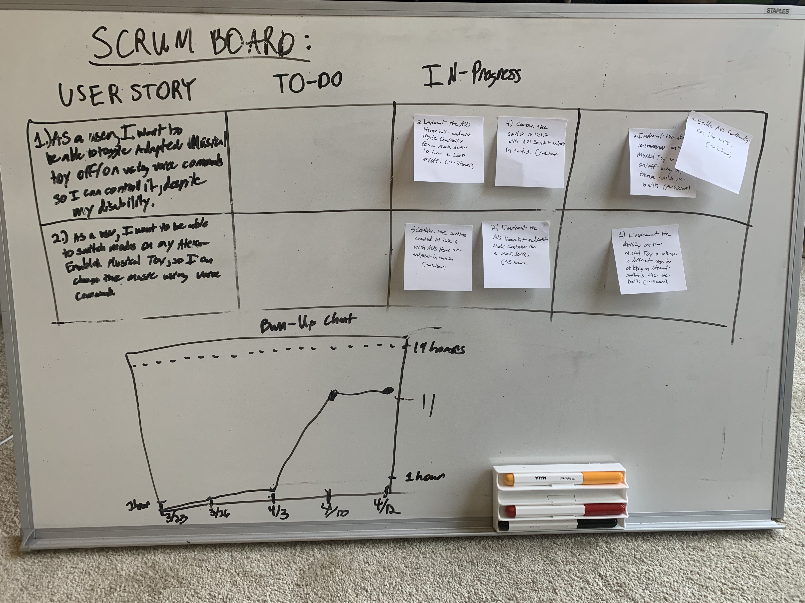

# Sprint 2 Report

***[Modular Adapter]*** by  ***Alexa-Enabled Accessibility Team 1***

**Github:** github.com/acheewakarn/alexa-enabled-accessibility

**Sprint Completion Date:** [4/12/20]

**Published on:** [4/13/20]

---

## Actions to stop doing

- Skipping MWF meetings. Even if it is a small meeting, 

## Actions to start doing

- Coding Sessions.
- Have some kind of system to notify people when you are finished.
- Setup something like JIRA.

## Actions to keep doing

- Researching

## Work completed

## Work not completed

- As a user, I want to be able to toggle my Adapted Musical Toy on/off using voice commands so I can control it despite my disability.
- As a user, I want to be able to switch modes on my Alexa-Enabled Musical Toy so I can change the music using voice commands.

## Work completion Rate

- Burn Up Chart 11/19 hours of work.

## Final Scrum and Burn-Up Chart:

