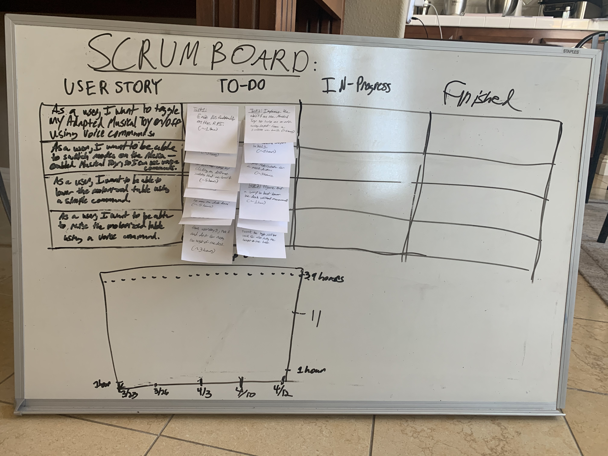

# Sprint 4 Plan

***Modular Adapter*** by  ***Alexa-Enabled Accessibility Team 1***

**Sprint Completion Date:** 4/19/20

**Github:** github.com/acheewakarn/amazon-enabled-accessibility

---

## Goal

- Finish connecting musical toy to RPI with AVS Homekit.
- Create system to connect multiple devices to RPI and have the RPI be able to figure what device pins are related to what GPIO pins.
- Start adding functionality to motorized desk and RPI with AVS HomeKit.

## Task

- As a user, I want to be able to toggle my Adapted Musical Toy on/off using voice commands so I can control it despite my disability.
  - Task 1: Enable AVS functionality on the RPI. (~1 hour)
  - Task 2: Implement the ability on the Musical Toy to turn on or off using input from a switch we built.  (~5 hours)
  - Task 3: Implement the AVS Home Kit endpoint ToggleController for a mock device to be able to turn a LED on and off. This will use directives such as TurnOn and TurnOff.(~3 hours)
  - Task 4: Combine the switch created in task 2 with the AVS Home Kit endpoint in task 3. (~1 hour)
  Total Hours for User Story: ~10 Hours
- As a user, I want to be able to switch modes on my Alexa-Enabled Musical Toy so I can change the music using voice commands.
  - Task 1: Implement the ability on the Musical Toy to change to different songs by clicking on different switches that we built. (~5 hours).
  - Task 2: Implement the AVS Home Kit endpoint ModeController for a mock device. Implement the SetMode to switch on different LEDs on a breadboard to simulate different modes on the Musical Toy.(~3 hours)
  - Task 3: Combine the switches created in task 1 with the AVS Home Kit endpoint in task 2. (~ 1 hour)
  Total Hours for User Story: ~9 Hours
 - As a user, I want to be able to lower my motorized desk using voice commands such as “lower by 2”, so I can adjust the desk to an optimal level.
    - Task 1: Connect microcontroller on the motorized desk to the RPI, and use the RPI to move the desk down. (~5 hours)
    - Task 2: Figure out a way to best lower the desk without precise measurements like inches. (~1 hour)
    - Task 3: Build homekit device called "table" and use homekit skill "toggle" to decrease the height of the table. (~ 5 hours)
    - Task 4: Combine homekit skill and device to hardware part of the RPI connected to the motorized table. (~3 hours)
    Total Hours for User Story: ~14 Hours
 - 	As a user, I want to be able to raise my motorized desk using voice commands such as “raise by 2”, so I can adjust the desk to an optimal level.
    - Task 1: Take work from userstory 3, task 1 and do it for raising the height of the desk. (~3 hours)
    - Task 2: Take homekit device and toggle skill, then tweak toggle skill to work for also raising the height of the table. (~3 hours)
    Total Hours for User Story: ~6 Hours

## Initial Task Assignment

**Anon Cheewakarn:** user story 1, task 3

**Chris Gunter:** user story 1, task 3

**Kenneth Mai:** user story 1, task 3

## Initial Burnup Chart & Initial Scrum Board

## Meeting Time

| Day                     | Time        | TA  |
| ----------------------- | ----------- | --- |
| Monday/Wednesday/Friday | 1:30-2:30PM | No  |
| Tuesday                 | 3:20-4:05PM | Yes |
