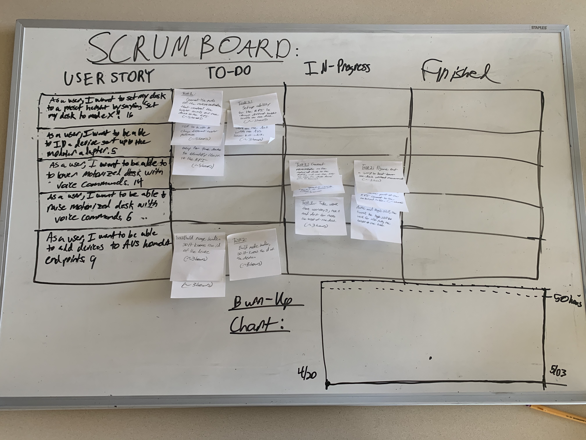

# Sprint 5 Plan

***Module Adapter*** by  ***Alexa-Enabled Accessibility Team 1***

**Sprint Period:** 4/20/20-5/03/20

**Github:** github.com/acheewakarn/amazon-modular-adapter

---

## Goal

- Finish all functionality for the table including the ability to raise and lower the table. With also being able to switch different heights of it.
- Also, finish building a way for other developers to add new endpoints for new devices in a way that is the least invasive to the rest of the AVS code.
- Also, finish ability to add ability for the modular adapter to recognise the device and generate a config file for that device.

## Task

- **User Story 1**: As a user, I want to be able to raise my motorized desk using voice commands such as “raise by 2”, so I can adjust the desk to an optimal level.
  - Task 1: Connect microcontroller on the motorized desk to the RPI, and use the RPI to move the desk down. (~5 hours)
  - Task 2: Figure out a way to best lower the desk without precise measurements like inches. (~1 hour)
  - Task 3: Build homekit device called “table” and use homekit skill “range” to decrease the height of the table. (~5 hours) 
  - Task 4: Combine homekit skill and device to hardware part of the RPI connected to the motorized table. (~3 hours)
- **User Story 2**: As a user, I want to be able to lower my motorized desk using voice commands such as “lower by 2”, so I can adjust the desk to an optimal level.
  - Task 1: Take homekit device and range skill, then tweak range skill to work for also raising the height of the table. (~3 hours)
  - Task 2: Take work from userstory 3, task 1 and do it for raising the height of the desk. (~3 hours)
- **User Story 3**: As a user, I want to be able to easily setup my RPI to know which device it is using some kind of system, without the user doing that much.
  - Task 1: Figure out a way for the device to identify itself the RPI, so the RPI knows what leads to use for each endpoint. (~5 hours)
- **User Story 4**: As a user, I want to set my desk to a specific preset height by saying “raise/lower my desk to mode x” to Alexa, so I can use the memory feature.
  - Task 1: Connect the parts of the microcontroller that control the height levels of the desk to the RPI. (~5 hours)
  - Task 2: Setup ability for the RPI to change different height levels on the desk. (~3 hours)
  - Task 3: Implement home kit device table with mode skill to be able to change different height preferences. (~5 hours)
  - Task 4: Merge the hardware work on the desk with the AVS home kit skill. (~3 hours)
- **User Story 5**: As a developer, I want to able to easily add devices to AVS HomeKit endpoints in a very clear way without having to hardcode any of the endpoints.
  - Task 1: Build range handler, so it knows the id of the device that it is being called on. (~3 hours)
  - Task 2: Build mode handler, so it knows the id of the device that it is being called on. (~3 hours)
  - Task 3: Build toggle handler, so it knows the id of the device that it is being called on. (~3 hours)

## Initial Task Assignment

**Anon Cheewakarn:** user story 3, initial task 1 & user story 5

**Chris Gunter:** user story 3, initial task 1

**Kenneth Mai:** user story 4, initial task 1

## Initial Burnup Chart & Initial Scrum Board

## Meeting Time

| Day                     | Time        | TA  |
| ----------------------- | ----------- | --- |
| Monday/Wednesday/Friday | 1:30-2:30PM | No  |
| Tuesday                 | 3:20-4:05PM | Yes |

