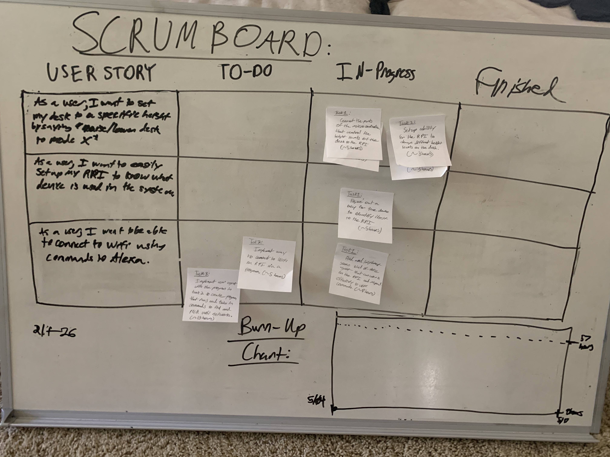

# Sprint 6 Plan

***Module Adapter*** by  ***Alexa-Enabled Accessibility Team 1***

**Sprint Period:** 5/04/20-5/17/20

**Github:** github.com/acheewakarn/amazon-modular-adapter

---

## Goal

- Finish up the rest of the functionality with the motorized table with setting up the separate modes.
- Implement the ability to connect the RPI to the Wifi using voice commands.

## Task

- **User Story 1**: As a user, I want to be able to easily setup my RPI to know which device it is using some kind of system, without the user doing that much.
  - Task 1: Figure out a way for the device to identify itself the RPI, so the RPI knows what leads to use for each endpoint. (~5 hours)
- **User Story 2**: As a user, I want to set my desk to a specific preset height by saying “raise/lower my desk to mode x” to Alexa, so I can use the memory feature.
  - Task 1: Connect the parts of the microcontroller that control the height levels of the desk to the RPI. (~5 hours)
  - Task 2: Setup ability for the RPI to change different height levels on the desk. (~3 hours)
  - Task 3: Implement home kit device table with mode skill to be able to change different height preferences. (~5 hours)
  - Task 4: Merge the hardware work on the desk with the AVS home kit skill. (~3 hours)
- **User Story 3**: As a user, I want to be able to connect to my Wifi by using commands to the Alexa, so I don't need to stand up and do it myself.
  - Task 1: Find and implement some kind of voice agent that can work on the RPI and respond effectively to voice commands. (~8 hours)
  - Task 2: Implement way to connect to Wifi on RPI via a program. (~5 hours)
  - Task 3: Implement user agent with the program in task 2 to create program that runs and takes in commands to find and pick Wifi networks. (~13 hours)

## Initial Task Assignment

**Anon Cheewakarn:** user story 1, initial task 1

**Chris Gunter:** user story 3, initial task 1

**Kenneth Mai:** user story 2, initial task 1

## Initial Burnup Chart & Initial Scrum Board

## Meeting Time

| Day                     | Time        | TA  |
| ----------------------- | ----------- | --- |
| Monday/Wednesday/Friday | 1:30-2:30PM | No  |
| Tuesday                 | 3:20-4:05PM | Yes |

