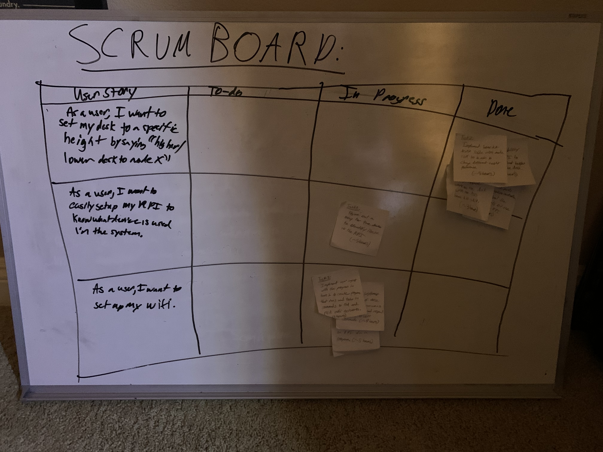
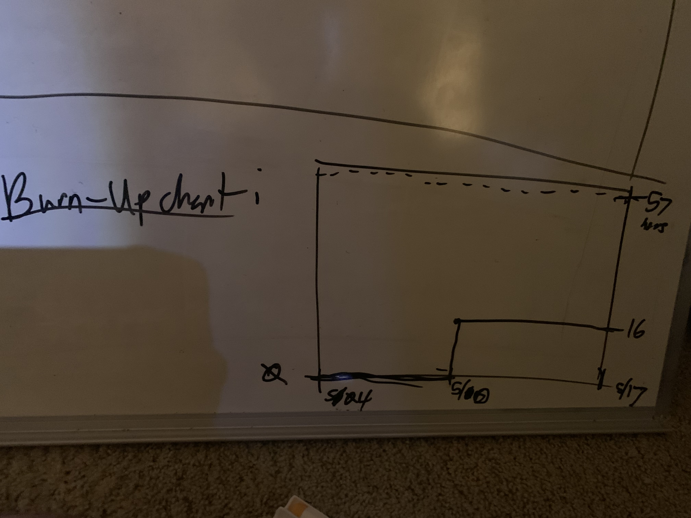

# Sprint 5 Report

***Module Adapter*** by  ***Alexa-Enabled Accessibility Team 1***

**Github:** github.com/acheewakarn/alexa-enabled-accessibility

**Sprint Completion Date:** 5/18/20

**Published on:** 5/18/20

---

## Actions to stop doing
- Falling behind on previous tasks.

## Actions to start doing
- Keep JIRA up to date.
- Keep documentation up to date.

## Actions to keep doing

- Communicate any roadblocks. 
- Keep working on the README with making sure that it is fully up to date we the progress that we have done.

## Work completed

- As a user, I want to set my desk to a specific preset height by saying “raise/lower my desk to mode x” to Alexa, so I can use the memory feature.

## Work not completed

- As a user, I want to be able to easily setup my RPI to know which device it is using some kind of system, without the user doing that much.
- As a user, I want to be able to connect to my Wifi by using commands to the Alexa, so I don't need to stand up and do it myself.

## Work completion Rate

- Burn Up Chart 16/57 hours of work.

## Final Scrum and Burn-Up Chart:

